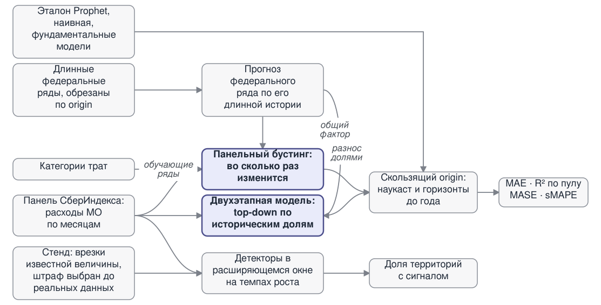

```{python}
import sys, warnings
warnings.filterwarnings("ignore")
sys.path.insert(0, "..")
import numpy as np, pandas as pd
from IPython.display import Markdown

def md_table(df, floatfmt="{:,.0f}"):
    return Markdown(df.to_markdown(floatfmt=".2f"))

def _num(value, digits, sign=False):
    """Как `num` отчёта: разряды, запятая и минус «−» — на одном числе, а не заменой
    во всей строке; «+» у выигрыша. Знак — по округлённому числу, чтобы не было «+0,0»
    и «−0,000»; NaN — прочерк."""
    if not np.isfinite(value):
        return "—"
    value = round(float(value), digits) + 0.0  # + 0.0 превращает −0.0 в 0.0
    text = format(value, ("+" if sign and value > 0 else "") + f",.{digits}f")
    return text.replace(",", "\u00a0").replace(".", ",").replace("-", "−")

def _plural(n, one, few, many):
    """Форма слова при числе: 1 фолд, 2 фолда, 5 фолдов."""
    n = abs(int(n)) % 100
    if 11 <= n <= 14:
        return many
    return {1: one, 2: few, 3: few, 4: few}.get(n % 10, many)

def _and_join(items):
    """«a», «a и b», «a, b и c»."""
    items = [str(i) for i in items]
    return items[0] if len(items) == 1 else ", ".join(items[:-1]) + " и " + items[-1]

# Числа слайдов — из тех же файлов, что отчёт: руками переписанные не обновились бы
# при перепрогоне. read_results — тот же guard, что в отчёте: обычный CSV или, на чистом
# клоне без прогона, его снимок .csv.gz (per_series.csv коммитится только снимком).
from src.results_guard import read_results, refused
_sum = pd.read_csv("../results/summary.csv", index_col=0)
_ps = read_results("../results/per_series.csv", usecols=["model", "fold", "mae", "error"])
_pf = (_ps[_ps["error"].isna() & _ps["mae"].notna()]
       .pivot_table(index="model", columns="fold", values="mae"))
_ORD = {0: "первом", 1: "втором", 2: "третьем"}
# _FOLD_LEN/_FOLD_MO (длина обучения фолдов) вычисляются ниже, в «Первая находка», сразу
# после того как там же для другой цели загружается панель (`wide`) — не здесь, чтобы
# не грузить её дважды: длина обучения — функция панели и split.horizon/n_folds конфига.
_GEN = ["нуля", "одного", "двух", "трёх", "четырёх", "пяти", "шести", "семи", "восьми", "девяти", "десяти"]
# Корпус новостей — из помесячных агрегатов: сырых заголовков в репозитории нет, а сумма
# `n_articles` равна числу заголовков корпуса.
_news_monthly = pd.read_parquet("../data/news/monthly.parquet", columns=["region_name", "n_articles"])
```

## Задача

**Прогнозировать потребление в муниципальных образованиях и заранее выявлять
точки структурных изменений.**

Данные — потребительские безналичные расходы СберИндекса:

| | |
|---|---|
| муниципальных образований | **2190** |
| период | январь 2023 — декабрь 2024 |
| точек на ряд | **24** |
| категорий трат | 6 |

Двадцать четыре точки на ряд определяют в этой работе всё.

## Главный вывод {.smaller}

::: {.callout-note}
## Задача только выглядит как прогноз двух тысяч муниципалитетов
На деле это прогноз **одного числа** и разнос его по территориям.
:::

```{python}
_dec = pd.read_csv("../results/error_decomposition.csv")
Markdown(
    f"**Измерение.** Ошибка делится на промах мимо общего движения страны и разброс "
    f"между муниципалитетами. Разброс укладывается в **{_num(_dec['разброс'].min(), 0)}–"
    f"{_num(_dec['разброс'].max(), 0)} ₽ по всем {len(_dec)} сочетаниям модели и фолда** "
    f"при стандартном отклонении {_num(_dec['разброс'].std(), 0)}. MAE при этом гуляет от "
    f"{_num(_dec['MAE'].min(), 0)} до {_num(_dec['MAE'].max(), 0)}. Остальное не сдвинула "
    f"ни одна из {_GEN[_dec['модель'].nunique()] if _dec['модель'].nunique() <= 10 else _dec['модель'].nunique()} "
    f"моделей разложения."
)
```

**Конструкция.** Двухэтапная модель прогнозирует **один** федеральный ряд
и разносит долями, не глядя на динамику отдельных рядов — и на фолде с самой
короткой историей оказывается лучшей из всех.

## Первая находка: ловушка годовой сезонности {.smaller}

```{python}
import logging
for n in ("prophet","cmdstanpy"): logging.getLogger(n).setLevel(logging.CRITICAL)
from src.data import load_panel, build_matrix
from src.models.prophet_model import ProphetModel
panel = load_panel("../data/raw/mo_spending_2023-2024.parquet")
wide, _ = build_matrix(panel, "Все категории", max_gap=2)
# Длина обучения фолдов — тем же способом, что конвейер (src/split.py::rolling_origin),
# из панели и протокола configs/full.yaml, а не вписана руками: неразрывный пробел — чтобы
# «15 мес» в шапке не рвалось на две строки.
import yaml as _yaml_fl
from src.split import rolling_origin
_full_cfg = _yaml_fl.safe_load(open("../configs/full.yaml", encoding="utf-8"))
_full_folds = rolling_origin(wide.shape[0], _full_cfg["split"]["horizon"], _full_cfg["split"]["n_folds"])
_FOLD_LEN = {f.index: f"{f.train_end}\u00a0мес" for f in _full_folds}
# Шапки таблиц ссылались только на длину обучения; текст рядом говорит «первый/третий
# фолд», и без номера фолда связь между ними терялась. Номер — как в отчёте и на слайде
# «Перенос с длинных рядов» («в таблицах — фолд 0»): с нуля, из того же индекса, что и _ORD.
_FOLD_MO = {k: f"фолд {k}: обучение {v}." for k, v in _FOLD_LEN.items()}
y = wide["городской округ город Орёл"].to_numpy(float)
rows = {}
for label, kw in [("Prophet с годовой насильно", dict(yearly_seasonality=True)),
                  ("Prophet по умолчанию", {})]:
    rows[label] = np.round(ProphetModel(**kw).set_index(wide.index).fit(y[:15]).predict(3))
rows["факт"] = np.round(y[15:18])
from src import charts
_fig = charts.prophet_failure(wide, "городской округ город Орёл", rows["Prophet с годовой насильно"], rows["Prophet по умолчанию"])
_ax = _fig.axes[0]
# В отчёте та же функция рисуется на высоте 3.9in, и легенда в один столбец у верхнего
# края там не мешает. Здесь высота вчетверо меньше (2.05in под {.smaller}): та же легенда
# перекрывала линию истории обучения, а собственный маркер «факт» — подпись «факт»
# в легенде. Переносим в пустой нижний левый угол (данные туда не заходят) двумя
# столбцами и даём запас по осям, чтобы подпись «−9 772 ₽» не упиралась в край.
_ax.legend(frameon=False, fontsize=8, labelcolor=charts.INK_SOFT, loc="lower left",
           ncol=2, columnspacing=1.2, handlelength=1.6, handletextpad=0.5)
_ylo, _yhi = _ax.get_ylim()
_ax.set_ylim(_ylo - 0.12 * (_yhi - _ylo), _yhi)
_xlo, _xhi = _ax.get_xlim()
_ax.set_xlim(_xlo, _xhi + 0.07 * (_xhi - _xlo))
import matplotlib.pyplot as plt
_fig.set_size_inches(7.2, 2.05)  # тот же слайд с {.smaller}: полноразмерный график с текстом не помещался
_fig.tight_layout()
plt.show()
```

Годовая сезонность на 15 точках не идентифицируется — **прогноз уходит
в отрицательные значения**. Prophet предупреждает об этом сам.

```{python}
# Цена флага — на полной панели. Кратность подгонки не называем: во время прогона
# с насильной сезонностью машина уходила в подкачку, и время не чистое.
_fy, _pp = _sum.loc["prophet_forced_yearly"], _sum.loc["prophet"]
_k = round(_fy["MAE"] / _pp["MAE"])
Markdown(
    f"Один флаг: на полной панели MAE **{_num(_fy['MAE'], 0)} ₽** против {_num(_pp['MAE'], 0)} "
    f"у эталона — в **{_k} {_plural(_k, 'раз', 'раза', 'раз')}** больше, R² пул "
    f"{_num(_fy['R² пул'], 2)}; подгонка дороже."
)
```

::: {.callout-note}
**Эталон конкурса при этом в порядке.** Prophet по умолчанию задаёт
`yearly_seasonality='auto'` и на истории короче 730 дней сам её не включает,
выводя предупреждение; ловушка срабатывает только при ручном включении
сезонности. Эталон обходит наивный прогноз на 14,7%, так что планка настоящая.
:::

## Архитектура решения {.smaller}

<!-- Тот же файл, что в отчёте («Метод на одной странице»): report/method.svg.
Раньше был mermaid — библиотека тянула
в html ~2,8 МБ ради того же рисунка. Ширина — в пикселях слайда (1280): во всю ширину
(1094 px) фигура с заголовком и абзацем не помещались в 760 px (964 px факта), а подписи
не мельче 12 px требуют не меньше 12 × 1113 / 17 ≈ 786 px (viewBox 1113, подписи связей
17 px). 860 px — подписи 13,1 px, слайд помещается. -->

<figure>

</figure>

Основной протокол — `configs/full.yaml` (пилот на 300 рядах — `configs/baseline.yaml`);
горизонты — `configs/horizons.yaml`, разладки — `configs/changepoints.yaml`. В коде моделей
нет ни горизонта, ни правил разбиения.

## Сравнение моделей прогнозирования {.smaller}

```{python}
s = pd.read_csv("../results/summary.csv", index_col=0)
# Насильная годовая сезонность в разы дальше всех и сжала бы остальные столбцы у нуля;
# её число — на слайде о ловушке.
_fig = charts.model_comparison(s.drop(index=["prophet_forced_yearly"], errors="ignore"))
import matplotlib.pyplot as plt
_fig.set_size_inches(8.2, 5.7)  # иначе ~30 строк моделей не влезали в слайд по высоте
_fig.tight_layout()
plt.show()
```

Классические модели — **потолок подхода «одна модель на ряд»**; насильная
годовая сезонность не показана, чтобы не сжимать шкалу.

## Метрики рядом: MAE, MASE, R² {.smaller}

```{python}
# read_results/refused — импортированы в самом начале файла.
# Подписи короткие, как на слайде пяти горизонтов: полные подписи из отчёта переносились
# в две-три строки, и таблица со строкой под ней не помещалась на слайд по высоте.
_ru = {
    "naive_last": "наивная",
    "prophet": "эталон конкурса",
    "chronos_ft": "дообученный Chronos",
    "two_stage": "двухэтапная",
    "global_gbm": "базовая панельная",
    "global_gbm_stack_factor": "фактор + категории рядами",
}

_sm = pd.read_csv("../results/summary.csv", index_col=0).loc[list(_ru)].sort_values("MAE")
_tab = pd.DataFrame({
    "MAE, ₽": _sm["MAE"].map(lambda v: _num(v, 0)),
    "MASE": _sm["MASE"].map(lambda v: _num(v, 2)),
    "R² пул": _sm["R² пул"].map(lambda v: _num(v, 3)),
    "R² медиана": _sm["R² медиана"].map(lambda v: _num(v, 2)),
    # Выигрыш — по MAE: рядом колонки R², и без пометки его легко прочесть как выигрыш по R².
    "MAE к Prophet, %": _sm["к Prophet, %"].map(lambda v: _num(v, 1, sign=True)),
})
_tab.index = pd.Index([_ru[m] for m in _tab.index], name="модель")
# Не через md_table: разбор чисел tabulate принимает «0,978» за число с разделителем
# тысяч и выравнивает одну колонку иначе остальных. Числа уже строки — разбор выключен.
Markdown(_tab.to_markdown(disable_numparse=True, colalign=("left",) + ("right",) * len(_tab.columns)))
```

```{python}
# Строка под таблицей — по фактическим средним: вырожденным среднее называется, только
# если оно ниже нуля у всех, а «наивная лучшая» — только если это так.
_per = read_results("../results/per_series.csv", usecols=["model", "mae", "r2", "error"])
_mean = _per[~refused(_per) & _per["model"].isin(_ru)].groupby("model")["r2"].mean()
_span = f"от {_num(_mean.min(), 1)} до {_num(_mean.max(), 1)}"
if (_mean < 0).all() and _mean.idxmax() == _sm["MAE"].idxmax() == "naive_last":
    _line = (f"Среднее R² по парам ряд × фолд в таблицы не идёт: на трёх тестовых точках "
             f"оно вырождено — {_span}, и лучшей по нему выходит наивная модель, худшая по MAE.")
elif (_mean < 0).all():
    _line = (f"Среднее R² по парам ряд × фолд в таблицы не идёт: на трёх тестовых точках "
             f"оно вырождено — {_span}, ниже нуля у всех.")
else:
    _line = f"Среднее R² по парам ряд × фолд — {_span}; в таблицы идут пул и медиана."
Markdown(_line)
```

## Что дало выигрыш

**Не более хитрая модель одного ряда, а информация со стороны.**

Глобальная модель обучается на всей панели сразу и предсказывает
**отношение к последнему значению**, а не уровень:

- Магадан с 74 тыс. руб. и сельский район с 10 тыс. становятся сопоставимы
- модель учится на форме динамики, а не на масштабе

Это даёт 7,3% над эталоном. Остальное — два внешних источника.

## Перенос с длинных рядов: чего не хватает панели

Первый фолд (в таблицах — фолд 0): обучение кончается мартом 2024, прогнозируем апрель-июнь.
Признакам нужно шесть точек истории, поэтому целевые месяцы в обучении —
только июль-декабрь и январь-март.

**Апреля, мая и июня в обучении нет ни разу.**

Панельная модель не может знать апрельскую сезонность. Федеральный ряд
потребительских расходов — 93 месяца — видел пять апрелей.

Связь измерена: корреляция темпов роста с панелью **0,91**, эластичность **1,23**.

## Переносится не всё и не как угодно

```{python}
# Семь конструкций панельной модели — из summary.csv; имена моделей сверены по MAE
# (единственный однозначный ключ между слайдом и файлом).
_tr_map = {
    "global_gbm_stack_factor": "общий фактор + категории рядами",
    "global_gbm_factor": "общий фактор из длинной истории",
    "global_gbm_cat": "доли категорий как признаки",
    "global_gbm_stack": "категории как обучающие ряды",
    "global_gbm": "базовая, без внешних источников",
    "global_gbm_pretrain": "предобучение на отраслевых рядах",
    "global_gbm_ext": "те же ряды как внешние регрессоры",
}
_tr = _sum.loc[list(_tr_map), "MAE"].sort_values()
_tr_base = _sum.loc["global_gbm", "MAE"]


def _tr_delta(v):
    return "—" if abs(v - _tr_base) < 0.5 else _num(v - _tr_base, 0, sign=True) + " ₽"


_tr_rows = []
for _m in _tr.index:
    _label, _mae, _delta = _tr_map[_m], _num(_tr[_m], 0), _tr_delta(_tr[_m])
    if _m == _tr.index[0]:  # лучшая конструкция — строка целиком жирным
        _label, _mae, _delta = f"**{_label}**", f"**{_mae}**", f"**{_delta}**"
    elif _m == _tr.index[-1]:  # худшая — жирным только сам проигрыш
        _delta = f"**{_delta}**"
    _tr_rows.append(f"| {_label} | {_mae} | {_delta} |")
Markdown("\n".join(["| конструкция | MAE, ₽ | Δ к базовой |", "|---|---|---|"] + _tr_rows))
```

Те же данные. Пять конструкций. Работают две.

## Среднее скрывает перемену мест {.smaller}

```{python}
_avg_models = {"naive_last": "наивная", "global_gbm": "базовая панельная",
               "global_gbm_stack_factor": "общий фактор + категории"}
_avg = _pf.loc[list(_avg_models)].rename(index=_avg_models)
_avg_best = _avg.idxmin()  # лучшая модель в фолде меняется — это и есть смена лидера
_avg_tab = pd.DataFrame({c: [f"**{_num(v, 0)}**" if m == _avg_best[c] else _num(v, 0)
                              for m, v in _avg[c].items()] for c in _avg.columns}, index=_avg.index)
_avg_tab.columns = [_FOLD_MO[c] for c in _avg_tab.columns]
_avg_tab.index.name = "модель (MAE, ₽)"
Markdown(_avg_tab.to_markdown(disable_numparse=True, colalign=("left",) + ("right",) * len(_avg_tab.columns)))
```

**На первом фолде наивную не обходит ни одна панельная**, на третьем она же
худшая — ни одна модель не берёт все три фолда.

Разложение ошибки первого фолда: модель предсказывает падение на 8,3%, факт —
рост на 1,1%; **две трети ошибки — общее смещение**, а не разброс по рядам.

## Двухэтапная модель как конструкция {.smaller}

```{python}
_ts_models = {"naive_last": "наивная", "two_stage": "двухэтапная, сырой агрегат",
              "two_stage_sa": "двухэтапная, сглаженный агрегат"}
_ts = _pf.loc[list(_ts_models)].rename(index=_ts_models)
_ts_tab = _ts.map(lambda v: _num(v, 0))
_ts_tab.columns = [_FOLD_MO[c] for c in _ts.columns]
_ts_tab["среднее"] = [_num(_sum.loc[m, "MAE"], 0) for m in _ts_models]
# Жирным — сырой агрегат и его результат на самом коротком фолде: там он лучший из всех
# моделей вообще, см. «Главный вывод».
_ts_row = "двухэтапная, сырой агрегат"
_ts_tab.loc[_ts_row, _FOLD_MO[0]] = f"**{_ts_tab.loc[_ts_row, _FOLD_MO[0]]}**"
_ts_tab.index = [f"**{m}**" if m == _ts_row else m for m in _ts_tab.index]
_ts_tab.index.name = "модель (MAE, ₽)"
Markdown(_ts_tab.to_markdown(disable_numparse=True, colalign=("left",) + ("right",) * len(_ts_tab.columns)))
```

```{python}
# Разброс — из того же файла, что на слайде «Главный вывод» (_dec): у наивной и сырого
# агрегата он совпадает до рубля по построению, это и есть тезис слайда.
_ts_spread = _dec.loc[_dec["модель"] == "two_stage", "разброс"]
_fct = _sum.loc["naive_last", "MAE"] - _sum.loc["two_stage", "MAE"]
Markdown(
    f"Разброс двухэтапной модели **совпадает с наивной до рубля** — "
    f"{_and_join(_num(v, 0) for v in _ts_spread)}: тождество по построению, обе дают "
    f"«последнее значение × общий множитель». Разница между ними — ровно общий фактор, "
    f"и он стоит **{_num(_fct, 0)} ₽ из {_num(_sum.loc['naive_last', 'MAE'], 0)}**."
)
```

Сезонно сглаженный агрегат не годится: сглаживание вычищает именно ту сезонность,
которую разнос делит между муниципалитетами, — январь и декабрь у сырого агрегата и у самой
панели расходятся на десятки процентных пунктов, у сглаженного разница на порядок меньше.
Внутренний бэктест выбирает на нём `random_walk`.

## Пять горизонтов: от наукаста до года {.smaller}

```{python}
# Таблица — из horizons_summary.csv, только модели основной сюжетной линии: базовая панельная
# и разнос известного агрегата уже на других слайдах, а тут не помещались по высоте. Жирным —
# лучшая в столбце.
_hz = pd.read_csv("../results/horizons_summary.csv")
_hz_rows = {"naive_last": "наивная", "prophet": "эталон конкурса",
            "global_gbm_stack_factor": "фактор + категории рядами", "two_stage": "двухэтапная"}
_hw = _hz.pivot(index="model", columns="horizon", values="MAE").reindex(list(_hz_rows))
_hfold = _hz.drop_duplicates("horizon").set_index("horizon")["фолдов"]
_hbest = _hw.idxmin()
_hhead = {h: (f"наукаст ({_hfold[h]} {_plural(_hfold[h], 'фолд', 'фолда', 'фолдов')})" if h == 1
              else f"{h} мес ({_hfold[h]})") for h in _hw.columns}
_hlines = ["| модель (MAE, ₽) | " + " | ".join(_hhead[h] for h in _hw.columns) + " |",
           "|---|" + "---|" * len(_hw.columns)]
for _m, _label in _hz_rows.items():
    _cells = []
    for _h in _hw.columns:
        _v = _hw.loc[_m, _h]
        _cell = "нет примеров" if not np.isfinite(_v) else _num(_v, 0)
        _cells.append(f"**{_cell}**" if _m == _hbest[_h] else _cell)
    _name = f"**{_label}**" if _m == _sum["MAE"].idxmin() else _label
    _hlines.append(f"| {_name} | " + " | ".join(_cells) + " |")
Markdown("\n".join(_hlines))
```

```{python}
# Строки под таблицей — числами того же файла: переписанные руками «двадцать два рубля»
# и «точнее 1 350» с ним разошлись (точно — 21,4 и 1 356).
_hzi = _hz.set_index(["horizon", "model"])
_known1, _plain1 = _hzi.loc[(1, "two_stage_known"), "MAE"], _hzi.loc[(1, "two_stage"), "MAE"]
_hs = pd.read_csv("../results/horizons_steps.csv")
# Читаем здесь же, с остальными horizons_*.csv: нужен «Что не сработало: модели» (ниже)
# и «Выводам» — порядок кода, а не отдельный повод грузить файл на том слайде, где он впервые
# использовался раньше.
_hfs = pd.read_csv("../results/horizons_folds.csv")
_st = _hs[(_hs["horizon"] == 12) & (_hs["model"] == "naive_last")]
_st = _st[_st["fold"] == _st["fold"].min()]
_te = int(_st["train_end"].iloc[0])  # шаг s — месяц te + s, счёт с января 2023
_st = _st.set_index("step")["mae"]
_month_in = ["январе", "феврале", "марте", "апреле", "мае", "июне", "июле", "августе",
             "сентябре", "октябре", "ноябре", "декабре"]
_month_of = ["января", "февраля", "марта", "апреля", "мая", "июня", "июля", "августа",
             "сентября", "октября", "ноября", "декабря"]
# Лучшая модель основного протокола (`_sum`, configs/full.yaml) не обязана входить
# в configs/horizons.yaml — списки моделей независимы. Без проверки .loc[(1, top)] падал бы
# KeyError и весь рендер слайда останавливался; вместо этого — понятная замена абзаца.
_top = _sum["MAE"].idxmin()
if (1, _top) in _hzi.index:
    _ns_headline = f"**Наукаст: {_num(_hzi.loc[(1, _top), 'к Prophet, %'], 1)}% над эталоном.** "
else:
    _ns_headline = (f"**Наукаст: лучшая модель основного протокола ({_top}) не входит "
                     f"в `configs/horizons.yaml` — сравнение на горизонтах недоступно.** ")
Markdown(
    _ns_headline +
    f"Известный агрегат за текущий месяц добавляет {_num(_plain1 - _known1, 1)} рубля: движение "
    f"страны на месяц предсказуемо, остаток — разброс.\n\n"
    f"**Год вперёд: у панельных моделей нет обучающих примеров**, двухэтапная обходит эталон "
    f"на {_num(_hzi.loc[(12, 'two_stage'), 'к Prophet, %'], 0)}%. Даже оракул общего движения "
    f"не разносит точнее {_num(_hzi.loc[(12, 'two_stage_known'), 'MAE'], 0)}.\n\n"
    f"**Ошибка растёт не с расстоянием, а с календарём.** От {_month_of[(_te - 1) % 12]} наивная "
    f"ошибается на {_num(_st.max(), 0)} в {_month_in[(_te + _st.idxmax() - 1) % 12]} и на "
    f"{_num(_st.min(), 0)} в {_month_in[(_te + _st.idxmin() - 1) % 12]}."
)
```

## Прогноз на 2025 год: первый этап сверен с фактом {.smaller}

```{python}
# Прогноз вперёд от конца панели — scripts/forecast_forward.py по configs/forecast_forward.yaml.
# Рисунок — та же функция, что в отчёте; числа — из файла проверки агрегата, модели по горизонтам —
# из конфига.
import yaml
from pathlib import Path
from src import charts
from src.external import load_aggregate
import matplotlib.pyplot as plt
_fc_cfg = yaml.safe_load(Path("../configs/forecast_forward.yaml").read_text(encoding="utf-8"))
def _fc_hz_note():
    """Оговорка про точность разноса на истории — только если обе пары моделей есть
    в configs/horizons.yaml на нужных горизонтах: recommended[1] и two_stage_known читаются
    из конфигов, а не гарантированы в горизонтном протоколе."""
    keys = [(_fc_hmax, "two_stage_known"), (_fc_hmax, "two_stage"),
            (1, _fc_cfg["recommended"][1]), (1, "two_stage_known")]
    if any(k not in _hzi.index for k in keys):
        return "."
    if (_hzi.loc[keys[0], "MAE"] < _hzi.loc[keys[1], "MAE"]
            and _hzi.loc[keys[2], "MAE"] < _hzi.loc[keys[3], "MAE"]):
        return ("; на истории на год точнее разнос опубликованного агрегата (`two_stage_known`), "
                "на месяц — панельная модель.")
    return "."
_fc_chk = pd.read_csv("../results/" + _fc_cfg["output"]["aggregate_check"], dtype={"month": str})
_fc_hmax = int(_fc_chk["horizon"].max())
_fc_year = _fc_chk[_fc_chk["horizon"] == _fc_hmax]
_fc_mape = _fc_year.assign(e=_fc_year["error_pct"].abs()).groupby("method")["e"].mean()
_fc_below = int((_fc_year.loc[_fc_year["method"] == "two_stage", "error_pct"] < 0).sum())
_fc_agg = load_aggregate("../data/reference/sberindex")
_fig = charts.aggregate_check(_fc_agg, _fc_year)
_fig.set_size_inches(7.2, 2.2)  # 2,5 с тремя абзацами под ним — 803 px из 760
# Легенда функции (fontsize=9) при высоте figsize 2,2 отображалась мельче остального
# текста слайда — данные внизу-слева свободны на всём диапазоне (панель растёт), поле
# для более крупной подписи есть без наложения на линии.
_ax = _fig.axes[0]
_ax.legend(frameon=False, fontsize=11, labelcolor=charts.INK_SOFT, loc="upper left")
_fig.tight_layout()
plt.show()
```

```{python}
_fc_panel = [h for h, m in sorted(_fc_cfg["recommended"].items()) if m != "two_stage"]
_fc_origin = pd.Period(_fc_cfg["origin"], "M")
Markdown(
    f"**Прогноз от последнего месяца панели, декабря 2024:** на {_and_join(_fc_panel)} мес. — "
    f"панельная модель с долями категорий, на {_fc_hmax} — двухэтапная; {_num(len(wide.columns), 0)} "
    f"рядов в `results/{_fc_cfg['output']['forecast']}`.\n\n"
    f"**Федеральный агрегат за 2025 год уже опубликован:** первый этап двухэтапной модели ошибся "
    f"в среднем на {_num(_fc_mape['two_stage'], 1)}%, «как в декабре» — на "
    f"{_num(_fc_mape['naive'], 1)}%, «как год назад» — на {_num(_fc_mape['seasonal_naive'], 1)}%"
    # Почему ниже факта — по числам: первый этап складывает медианные приросты месяцев за годы
    # истории, а год прогноза рос быстрее этой медианы (но не быстрее двух предыдущих лет).
    + (f". Прогноз ниже факта все {_fc_below} месяцев: первый этап берёт медианный прирост "
       f"{(_fc_agg.index[0] + 1).year}–{_fc_origin.year}, а {_fc_origin.year + 1}-й рос быстрее.\n\n"
       if _fc_below == (_fc_year["method"] == "two_stage").sum()
       and (_fc_year.loc[_fc_year["method"] == "two_stage", "aggregate_model"] == "seasonal_median").all()
       else ".\n\n")
    + "**Муниципальный прогноз проверит факт** разреза за 2025 год"
    # Разнос опубликованного агрегата — не на всё: на истории он точнее на год вперёд, а на месяц
    # вперёд точнее панельная модель.
    + _fc_hz_note()
)
```

## Короче история — ценнее перенос {.smaller}

Выигрыш переноса к базовой модели, ₽ (минус = помогает):

```{python}
# Выигрыш и корреляция — из results/training_length_sweep.csv, столбец «стек + фактор»:
# тот же источник и тот же расчёт, что в отчёте (там — таблица `_rho` по всем источникам).
_sw = pd.read_csv("../results/training_length_sweep.csv")
_sw_col = "стек + фактор"
_sw_months = [12, 15, 18, 21]
_sw_sel = _sw[_sw["обучение, мес"].isin(_sw_months)].set_index("обучение, мес")
_sw_gain = _sw_sel[_sw_col] - _sw_sel["базовая"]
_sw_rho = (_sw[_sw_col] - _sw["базовая"]).corr(_sw["обучение, мес"], method="spearman")
_sw_bold = {_sw_gain.idxmin(), _sw_gain.idxmax()}
_sw_tab = pd.DataFrame(
    [[f"**{_num(_sw_gain[m], 0, sign=True)}**" if m in _sw_bold else _num(_sw_gain[m], 0, sign=True)
      for m in _sw_months],
     [_num(_sw_sel.loc[m, "базовая"], 0) for m in _sw_months]],
    index=["общий фактор + категории", "базовая модель, MAE, ₽"],
    columns=[f"{m} мес" for m in _sw_months],
)
Markdown(
    _sw_tab.to_markdown(disable_numparse=True, colalign=("left",) + ("right",) * 4)
    + f"\n\nРанговая корреляция выигрыша с длиной обучения — **{_num(_sw_rho, 2)}**."
)
```

```{python}
# «N дополнительных месяцев» и кратность — тем же расчётом, что «закон переноса» в резюме
# отчёта (_rs["law"]): базовая MAE на короткой длине развёртки / на длинной, из тех же
# results/training_length_sweep.csv, что таблица выше.
_NOM = ["ноль", "один", "два", "три", "четыре", "пять", "шесть", "семь", "восемь", "девять", "десять"]
_sw_lo, _sw_hi = min(_sw_months), max(_sw_months)
_sw_delta = _sw_hi - _sw_lo
_sw_law_k = _sw_sel.loc[_sw_lo, "базовая"] / _sw_sel.loc[_sw_hi, "базовая"]
Markdown(
    f"**{_NOM[_sw_delta].capitalize()} дополнительных "
    f"{_plural(_sw_delta, 'месяц', 'месяца', 'месяцев')} улучшают модель в "
    f"{_num(_sw_law_k, 1)} раза** — наивную модель тот же срок не улучшает вовсе: её ошибка "
    f"зависит от того, какие месяцы попали в тест, а не от длины истории."
)
```

::: {.callout-warning}
Прогнозировать предстоит с 24 месяцами обучения — за правым краем развёртки.
Для практики берём не лучшую по среднему модель, а лучшую на самом длинном обучении.
:::

## Почему регрессоры проваливаются

Федеральный ряд в месяце *t* **одинаков для всех 2028 муниципалитетов**: значений
в обучении фолда ровно столько, сколько там моментов.

- **9 различных значений** на всё обучение первого фолда
- треть признаков — **вне диапазона обучения**, и дерево там отдаёт константу

Это метка месяца, а не регрессор.

**Общий фактор работает иначе:** длинный ряд отвечает на вопрос, на который
короткий не может — какова сезонная форма месяца, которого в обучении не было.

## Обнаружение разладок: решает преобразование {.smaller}

<!-- Запас по низу был 1 px из 760 (759) — здесь же уместны шесть строк таблицы и два абзаца.
0,92em, как на слайде «Выводы» (::: {style="font-size: 0.9em;"}), даёт запас с двузначным числом
пикселей, не трогая ни состав, ни числа. -->
::: {style="font-size: 0.92em;"}

```{python}
# Стенд — из файлов scripts/changepoints.py (results/cp_*.csv): штраф выбран правилом
# до реальных данных, CUSUM — со своим порогом. Первые четыре колонки — темпы роста,
# две последние — сырые ряды; задержка — медиана среди обнаруженных.
import importlib.util
import yaml
_cp_cfg = yaml.safe_load(open("../configs/changepoints.yaml", encoding="utf-8"))
_cp_proto = f"v{_cp_cfg['protocol_version']}"
_cps = pd.read_csv("../results/cp_summary.csv")
_cpe = pd.read_csv("../results/cp_realtime_events.csv", dtype={"crossed_month": object})
# Файлы другой версии протокола или другой сетки штрафов на слайды молча не встанут: отчёт
# вместо чисел пишет сообщение, слайд без чисел хуже громкой ошибки.
assert set(_cps["protocol"]) == set(_cpe["protocol"]) == {_cp_proto}, "файлы стенда другой версии протокола"
assert (sorted(set(_cps["penalty"].dropna())) == sorted(set(_cpe["penalty"]))
        == sorted(float(p) for p in _cp_cfg["bench"]["penalties"])), "файлы стенда другой сетки штрафов"
_cp_sel = float(_cpe.loc[_cpe["selected"].astype(str).str.lower() == "true", "penalty"].iloc[0])
_cp_det, _cp_mode = _cp_cfg["realtime"]["detector"], _cp_cfg["realtime"]["mode"]
_cp_S = _cps[(_cps["penalty"] == _cp_sel) | _cps["penalty"].isna()].set_index(["detector", "mode"])
_CP_DET = {"pelt": "PELT", "binseg": "BinSeg", "window": "Window", "bottomup": "BottomUp",
           "kernel_rbf": "ядровой", "cusum": "CUSUM"}
_CP_DET_GEN = {**_CP_DET, "kernel_rbf": "ядрового"}  # после «у»
_cp_order = {d: i for i, d in enumerate(_cp_cfg["bench"]["detectors"])}
# Те же методы, что в отчёте: у которых в сводке есть и сырые ряды, и темпы роста. При равном
# J — порядок конфига (сортировка устойчивая): у PELT и BinSeg числа бывают одинаковы.
_cp_dets = sorted([d for d in _cp_cfg["bench"]["detectors"]
                   if (d, "raw") in _cp_S.index and (d, _cp_mode) in _cp_S.index],
                  key=lambda d: -round(_cp_S.loc[(d, _cp_mode), "J Юдена"], 9))

def _cp_pen(p):
    return _num(p, 0 if float(p).is_integer() else 1)

def _cp_n01(v):
    """Медиана месяцев: целая — без знаков, дробная — с одним."""
    return _num(v, 0 if float(v).is_integer() else 1)

def _cp_pct(v):
    """Процент с одним знаком; «0%», а не «0,0%»."""
    text = _num(v, 1)
    return f"{text[:-2] if text.endswith(',0') else text}%"

def _cp_col(mode, column, digits, sign=False):
    return [_num(_cp_S.loc[(d, mode), column], digits, sign) for d in _cp_dets]

_cp_tab = pd.DataFrame({
    "обнаружено, %": _cp_col(_cp_mode, "обнаружено, %", 1),
    "задержка, медиана, мес.": [_cp_n01(_cp_S.loc[(d, _cp_mode), "задержка, медиана"]) for d in _cp_dets],
    "ложных, %": _cp_col(_cp_mode, "ложных на чистых, %", 1),
    "J Юдена": _cp_col(_cp_mode, "J Юдена", 1, sign=True),
    "сырые: ложных, %": _cp_col("raw", "ложных на чистых, %", 1),
    "сырые: J": _cp_col("raw", "J Юдена", 1, sign=True),
}, index=pd.Index([_CP_DET[d] for d in _cp_dets], name="метод"))
Markdown(_cp_tab.to_markdown(disable_numparse=True, colalign=("left",) + ("right",) * 6))
```

```{python}
_cp_pr, _cp_prw = _cp_S.loc[(_cp_det, _cp_mode)], _cp_S.loc[(_cp_det, "raw")]
# Тезис — то же условие, что в отчёте (раздел, резюме, «Находки»): у каждого метода
# преобразование снижает ложные тревоги и поднимает J, а разброс J методов со штрафом
# на темпах роста меньше выигрыша любого из них.
_cp_own = set(_cps.loc[_cps["penalty"].isna(), "detector"])
_cp_gain = [_cp_S.loc[(d, _cp_mode), "J Юдена"] - _cp_S.loc[(d, "raw"), "J Юдена"]
            for d in _cp_dets if d not in _cp_own]
_cp_pen_J = [_cp_S.loc[(d, _cp_mode), "J Юдена"] for d in _cp_dets if d not in _cp_own]
_cp_thesis = (all(_cp_S.loc[(d, _cp_mode), "J Юдена"] > _cp_S.loc[(d, "raw"), "J Юдена"]
                  and _cp_S.loc[(d, _cp_mode), "ложных на чистых, %"]
                  < _cp_S.loc[(d, "raw"), "ложных на чистых, %"] for d in _cp_dets)
              and bool(_cp_gain) and max(_cp_pen_J) - min(_cp_pen_J) < min(_cp_gain))
# Лучший J — с ничьими: первым — детектор потокового сигнала, затем порядок конфига.
_cp_bJ = _cp_S["J Юдена"].round(9)
_cp_best_keys = sorted(_cp_S.index[_cp_bJ == _cp_bJ.max()],
                       key=lambda k: (k != (_cp_det, _cp_mode), _cp_order.get(k[0], 99), k[1]))
_cp_best_key = _cp_best_keys[0]
_cp_best = _cp_S.loc[_cp_best_key]
_cp_ON = {"raw": " на сырых рядах", "deseason": " без профиля месяца"}
_cp_best_on = _cp_ON.get(_cp_best_key[1], "")
# Во сколько раз лучший по J находит меньше, чем детектор потокового сигнала.
_cp_r = _cp_pr["обнаружено, %"] / _cp_best["обнаружено, %"] if _cp_best["обнаружено, %"] else np.nan
_cp_less = ((({2: "вдвое", 3: "втрое", 4: "вчетверо"}.get(round(_cp_r)) if abs(_cp_r - round(_cp_r)) < 0.15
              else None) or f"в {_num(_cp_r, 1)} раза") if np.isfinite(_cp_r) else "")
_cp_ties = [k for k in _cp_best_keys if k != (_cp_det, _cp_mode)]
if _cp_best_key == (_cp_det, _cp_mode):
    # Ничья — одним перечнем: «у PELT и BinSeg».
    _cp_best_says = (f"Лучший J — у {_and_join([_CP_DET_GEN[_cp_det]] + [_CP_DET_GEN[d] + _cp_ON.get(m, '') for d, m in _cp_ties])}"
                     + ".")
elif np.isfinite(_cp_r) and _cp_r >= 1.15:
    _cp_best_says = (f"Лучший J — {_num(_cp_best['J Юдена'], 1, sign=True)} у {_CP_DET_GEN[_cp_best_key[0]]}"
                     f"{_cp_best_on}, но находок {_cp_less} меньше, задержка "
                     f"{_cp_n01(_cp_best['задержка, медиана'])} мес. против {_cp_n01(_cp_pr['задержка, медиана'])}"
                     + (": уровень скромный." if _cp_best["J Юдена"] < 20 else "."))
else:
    _cp_best_says = (f"Лучший J — {_num(_cp_best['J Юдена'], 1, sign=True)} у {_CP_DET_GEN[_cp_best_key[0]]}"
                     f"{_cp_best_on}.")
# Край сетки штрафов и правила зачёта — из конфига; декабрь в сигналах засчитанных
# обнаружений — разрез results/cp_bench.csv, как в отчёте: без этой оговорки число
# обнаружения не называется.
_cp_grid = sorted(float(p) for p in _cp_cfg["bench"]["penalties"])
_cp_edge = ("наибольший" if _cp_sel == _cp_grid[-1] else "наименьший" if _cp_sel == _cp_grid[0]
            else None) if len(_cp_grid) > 1 else None
_cp_md, _cp_tw = _cp_cfg["bench"]["max_delay"], _cp_cfg["bench"]["twin_rule"]
_cp_rule = ", ".join(([f"не позже {_cp_md} мес. после врезки"] if _cp_md is not None else [])
                      + (["при молчащем нетронутом близнеце"] if _cp_tw else []))
_cpr = pd.read_csv("../results/cp_realtime.csv")
_cp_months = list(_cpr.loc[_cpr["penalty"] == _cp_sel, "month"])
# cp_bench.csv — крупный, на чистом клоне без прогона стенда лежит только снимком .csv.gz
# (read_results/resolve_results это находит сам); если нет и снимка вовсе — не роняем слайд,
# а пишем это в самой фразе.
try:
    _cpb = read_results("../results/cp_bench.csv", usecols=["detector", "mode", "penalty", "kind",
                                                             "detected", "signal"])
except FileNotFoundError:
    _cpb = None

def _cp_dec_cut(det):
    """Испорченные строки детектора на темпах роста при выбранном штрафе: сколько засчитано,
    сколько из них с сигналом в декабре и обнаружение без них, %."""
    b = _cpb[(_cpb["detector"] == det) & (_cpb["mode"] == _cp_mode) & (_cpb["penalty"] == _cp_sel)
             & (_cpb["kind"] != "none")]
    hit = b[b["detected"].astype(str).str.lower() == "true"]
    n_dec = sum(_cp_months[int(t)].endswith("-12") for t in hit["signal"])
    return len(hit), n_dec, ((len(hit) - n_dec) / len(b) * 100 if len(b) else np.nan)

if _cpb is None:
    _cp_dec_says = "разрез по сигналам в декабре недоступен: cp_bench.csv нет ни файлом, ни снимком"
else:
    _cp_hit_n, _cp_n_dec, _cp_det_nodec = _cp_dec_cut(_cp_det)
    _cp_dec_share = _cp_n_dec / _cp_hit_n * 100 if _cp_hit_n else np.nan
    # При нулевых ложных J методов со штрафом равен их обнаружению — доля декабря нужна у всех,
    # а не только у потокового: завышает J любого из них, не только PELT.
    _cp_dec_cuts = {d: _cp_dec_cut(d) for d in _cp_dets if d not in _cp_own}
    _cp_any_dec = any(n_dec for _, n_dec, _ in _cp_dec_cuts.values())
    _cp_dec_all = [n_dec / n_hit * 100 for n_hit, n_dec, _ in _cp_dec_cuts.values() if n_hit]
    _cp_dec_rng = (_cp_pct(min(_cp_dec_all)) if round(min(_cp_dec_all), 1) == round(max(_cp_dec_all), 1)
                   else f"{_cp_pct(min(_cp_dec_all))[:-1]}–{_cp_pct(max(_cp_dec_all))}") if _cp_dec_all else ""
    _cp_dec_says = ((f"у методов со штрафом на темпах роста {_cp_dec_rng} засчитанного — сигналы в декабре; "
                     f"у {_CP_DET_GEN[_cp_det]} без них {_cp_pct(_cp_det_nodec)}")
                    if _cp_any_dec and len(_cp_dec_all) > 1 else
                    f"{_cp_pct(_cp_dec_share)} обнаружений {_CP_DET_GEN[_cp_det]} — сигналы в декабре, "
                    f"без них — {_cp_pct(_cp_det_nodec)}" if _cp_n_dec else "")
Markdown(
    f"Штраф {_cp_pen(_cp_sel)} — по стенду, до реальных данных"
    + (f", край сетки: лучший мог лежать за ним" if _cp_edge else "")
    + ". " + (f"Зачёт — {_cp_rule}. " if _cp_rule else "")
    + ("" if _cp_thesis else "**Заголовок слайда этим прогоном не подтверждается.** ")
    + _cp_best_says
    + (f" **Но {_cp_dec_says}.**" if _cp_dec_says else "")
)
```

**На сырых рядах детекторы ловят сезонность и структуру рядов, а не изломы.**

:::

## Интерпретация на реальных данных {.smaller}

:::: {.columns}
::: {.column width="52%"}
```{python}
# Потоковый сигнал — доля МО, у которых в месяце начался эпизод тревоги (results/cp_realtime*.csv),
# при выбранном штрафе и при штрафе прежнего разбора: его берёт scripts/news_event_study.py.
from src import charts
import matplotlib.pyplot as plt
_cp_spec = importlib.util.spec_from_file_location("news_event_study", "../scripts/news_event_study.py")
_cp_nes = importlib.util.module_from_spec(_cp_spec)
_cp_spec.loader.exec_module(_cp_nes)
_cp_off_p = float(_cp_nes.PENALTY)
_cpr = pd.read_csv("../results/cp_realtime.csv")
_cpo = pd.read_csv("../results/cp_offline.csv")
_cpos = pd.read_csv("../results/cp_offline_series.csv")
_cp_events = sorted(str(e) for e in _cp_cfg["realtime"]["events"])
_cp_thr = float(_cp_cfg["realtime"]["threshold_share"])
_cp_months = list(_cpr.loc[_cpr["penalty"] == _cp_sel, "month"])
_cp_RT = _cpr.pivot(index="month", columns="penalty", values="share").reindex(_cp_months)
_cp_OFF = _cpo.pivot(index="month", columns="penalty", values="share").reindex(_cp_months)
_cp_kr = pd.read_parquet("../data/reference/key_rate.parquet")
_cp_kr = _cp_kr[_cp_kr["key_rate_categories"] == "Ключевая ставка в реальном выражении"].copy()
_cp_kr["month"] = pd.to_datetime(_cp_kr["period"]).dt.strftime("%Y-%m")
_cp_panels = {f"Потоково, штраф {_cp_pen(_cp_sel)} — выбран по стенду: начала эпизодов тревоги":
              _cp_RT[_cp_sel]}
if _cp_off_p != _cp_sel:
    _cp_panels[f"Потоково, штраф {_cp_pen(_cp_off_p)}"] = _cp_RT[_cp_off_p]
_fig = charts.breaks_vs_rate(_cp_panels, _cp_kr.set_index("month")["value"].reindex(_cp_months),
                             _cp_thr, marks=_cp_events)
# Под картинкой на слайде — таблица рангового вида, и картинка ниже, чем в отчёте.
_fig.set_size_inches(8, 4.3)
_fig.tight_layout()
plt.show()
```

```{python}
# Ранговый вид (results/cp_realtime_rank.csv) — описание, а не второй порог: место доли месяца
# события среди наблюдаемых месяцев того же штрафа, в скобках — сама доля. Слов «прошёл / не
# прошёл» у него нет ни здесь, ни в отчёте.
_CP_NOM = ["январь", "февраль", "март", "апрель", "май", "июнь", "июль", "август", "сентябрь",
           "октябрь", "ноябрь", "декабрь"]
_CP_IN = ["январе", "феврале", "марте", "апреле", "мае", "июне", "июле", "августе", "сентябре",
          "октябре", "ноябре", "декабре"]
_CP_OF = ["января", "февраля", "марта", "апреля", "мая", "июня", "июля", "августа", "сентября",
          "октября", "ноября", "декабря"]

def _cp_ym(month, names=_CP_NOM):
    return f"{names[int(month[5:]) - 1]} {month[:4]}"

_cp_EV = _cpe.set_index(["penalty", "event"])
# Ранговый вид — необязательная часть (`realtime.rank_view`): без его файла — строка вместо таблицы.
try:
    _cpk = pd.read_csv("../results/cp_realtime_rank.csv", dtype={"event": object})
except FileNotFoundError:
    _cpk = pd.DataFrame()
_cp_pens = [_cp_sel] + ([_cp_off_p] if _cp_off_p != _cp_sel else [])
_cp_KV = ({p: g.set_index("month") for p, g in _cpk.groupby("penalty")}
          if len(_cpk) and _cp_cfg["realtime"].get("rank_view") and set(_cp_pens) <= set(_cpk["penalty"])
          and set(_cpk["protocol"]) == {_cp_proto} else {})
if _cp_KV:
    _cp_nm = int(_cp_KV[_cp_sel]["n_months"].iloc[0])
    _cp_rk = pd.DataFrame(
        {f"штраф {_cp_pen(p)}": [f"{_cp_n01(_cp_KV[p].loc[e, 'rank'])} из {_cp_nm} "
                                 f"({_cp_pct(_cp_KV[p].loc[e, 'share'])})" for e in _cp_events] for p in _cp_pens},
        index=pd.Index([_cp_ym(e) for e in _cp_events], name="ранговый вид"))
    _cp_rk_md = Markdown(_cp_rk.to_markdown(disable_numparse=True, colalign=("left",) + ("right",) * len(_cp_pens)))
else:
    _cp_rk_md = Markdown("Рангового вида нет: `results/cp_realtime_rank.csv` не записан.")
_cp_rk_md
```
:::
::: {.column width="48%"}
```{python}
def _cp_dec(p, e):
    """Переход порога в декабре позже месяца события: доля декабря против месяцев между ними —
    сигнал может давать сам декабрьский скачок."""
    c = _cp_EV.loc[(p, e), "crossed_month"]
    if not (isinstance(c, str) and c.endswith("-12") and c != e):
        return ""
    between = _cp_months[_cp_months.index(e):_cp_months.index(c)]
    return (f" ({_num(_cp_RT.loc[c, p], 1)}% против "
            f"{_and_join(_num(_cp_RT.loc[m, p], 1) for m in between)}% в "
            f"{_and_join(_CP_IN[int(m[5:]) - 1] for m in between)} — сигнал в самом декабре)")

def _cp_line(p):
    """Переходы порога при штрафе p: месяц и задержка, у непройденных — наибольшая доля."""
    cr = [e for e in _cp_events if isinstance(_cp_EV.loc[(p, e), "crossed_month"], str)]
    ms = [e for e in _cp_events if e not in cr]
    if not cr:
        return (f"порог {_num(_cp_thr, 0)}% не перейдён ни разу, наибольшая доля — "
                f"{_num(_cp_RT[p].max(), 1)}% ({_cp_ym(_cp_RT[p].idxmax())})")
    text = "; ".join(f"{_cp_ym(e)} — порог в {_cp_ym(_cp_EV.loc[(p, e), 'crossed_month'], _CP_IN)}"
                     + _cp_dec(p, e)
                     + f", задержка {int(_cp_EV.loc[(p, e), 'delay'])} мес." for e in cr)
    if ms:
        text += (f"; {_and_join(_cp_ym(e) for e in ms)} — нет ("
                 + _and_join(_num(_cp_EV.loc[(p, e), "max_share"], 1) for e in ms) + "%)")
    return text

_cp_NS = _cpr.pivot(index="month", columns="penalty", values="n_signals").reindex(_cp_months)
_cp_nn = (_cpr["n_signals"] / _cpr["share"])[lambda v: np.isfinite(v)]
_cp_n_panel = int(round(float(_cp_nn.iloc[0]) * 100)) if len(_cp_nn) else None

def _cp_rank_note(p):
    """К ранговому виду при штрафе p: первое место месяца события — числом МО; первый
    проверяемый месяц выше месяца события — эффект старта; фон — долей и числом МО.
    Без рангового вида — пусто."""
    if p not in _cp_KV:
        return ""
    K = _cp_KV[p]
    first, bg = K.index[0], float(K["background_median"].iloc[0])
    notes = []
    lead = [e for e in _cp_events if K.loc[e, "rank"] == 1 and K.loc[e, "share"] > 0]
    if lead and _cp_n_panel:
        notes.append(f"{_cp_ym(lead[0])} — первый по доле месяц, но это {int(_cp_NS.loc[lead[0], p])} МО "
                     f"из {_num(_cp_n_panel, 0)}")
    below = [e for e in _cp_events if K.loc[first, "share"] > K.loc[e, "share"]]
    if below:
        notes.append(f"{_cp_ym(first)} выше "
                     + ("всех трёх событий" if len(below) == len(_cp_events) == 3
                        else _and_join(_cp_ym(e, _CP_OF) for e in below))
                     + " — эффект старта")
    # Фон в один-два МО — с двумя знаками: «0,0%» при одном ряде читался бы нулём.
    bg_txt = f"{_num(bg, 2 if bg < 0.1 else 1)}%"
    notes.append("фон нулевой" if bg == 0 else
                 f"фон {bg_txt} ({_num(bg * _cp_n_panel / 100, 0)} МО)" if _cp_n_panel else
                 f"фон {bg_txt}")
    return "; ".join(notes)

_cp_off = _cp_OFF[_cp_off_p]
_cp_top = sorted(_cp_off.nlargest(len(_cp_events)).index, key=_cp_months.index)
def _cp_bullet(p):
    note = _cp_rank_note(p)
    return f"{_cp_line(p).rstrip('.')}" + (f"; {note}" if note else "") + "."

Markdown(
    f"- **Штраф {_cp_pen(_cp_sel)}, выбран по стенду:** {_cp_bullet(_cp_sel)}\n"
    + (f"- **Штраф {_cp_pen(_cp_off_p)}:** {_cp_bullet(_cp_off_p)}\n"
       if _cp_off_p != _cp_sel else "")
    + f"- **Задним числом, по полному ряду** (штраф {_cp_pen(_cp_off_p)}): "
    + ", ".join(f"{_cp_ym(m)} — {_num(_cp_off[m], 1)}%" for m in _cp_top)
    + f"; в остальные месяцы не выше {_num(_cp_off.drop(index=_cp_top).max(), 1)}%."
)
```
:::
::::

## Чего мы не утверждаем

```{python}
# Пара изломов по полному ряду — из results/cp_offline_series.csv; число событий — из конфига.
_cp_os = _cpos[_cpos["penalty"] == _cp_off_p]
_cp_e0, _cp_e1 = _cp_events[0], _cp_events[1]
_cp_with0 = set(_cp_os.loc[_cp_os["month"] == _cp_e0, "series_id"])
_cp_pair = len(_cp_with0 & set(_cp_os.loc[_cp_os["month"] == _cp_e1, "series_id"]))
_cp_jans = [m for m in _cp_months[1:] if m.endswith("-01")]
Markdown(
    f"{_GEN[len(_cp_events)].capitalize()} событий недостаточно для вывода о причинности: связь "
    f"с денежной политикой — совпадение и гипотеза.\n\n"
    + (f"{_cp_ym(_cp_e0).capitalize()} и {_cp_ym(_cp_e1)} по полному ряду — не два шока: у "
       f"{_num(_cp_pair, 0)} из {_num(len(_cp_with0), 0)} "
       f"{_plural(len(_cp_with0), 'ряда', 'рядов', 'рядов')} с изломом в "
       f"{_cp_ym(_cp_e0, _CP_IN)} есть излом и в {_cp_ym(_cp_e1, _CP_IN)}: это начало и конец "
       f"одного отрезка.\n\n" if _cp_with0 and _cp_pair / len(_cp_with0) >= 0.9 else "")
    + f"Январь неотделим от сезонности: ряд начинается в {_cp_ym(_cp_months[0], _CP_IN)}, "
    f"и детектируемый январь у нас "
    + ("ровно один." if len(_cp_jans) == 1 else f"не один: {len(_cp_jans)}.")
)
```

Показатель — оценка среднедушевых расходов, методология муниципального уровня
не опубликована. Мы прогнозируем **опубликованный ряд**, а интерпретируем только
относительные величины.

## Что не сработало: модели {.smaller}

```{python}
# Дообучение — по сводке и пофолдово; повтор с тем же сидом — по снимку первого
# сидированного прогона и текущим строкам: третий фолд в них расходится.
_zsn = {"chronos_small": "Chronos-Bolt small", "moirai": "Moirai", "timesfm": "TimesFM 2.5"}
_zsn_fold = {**_zsn, "chronos_base": "Chronos-Bolt base"}
_loss = pd.Series({m: -_sum.loc[m, "к наивной, %"] for m in _zsn}).sort_values(ascending=False)
_ftm, _zsm = _sum.loc["chronos_ft", "MAE"], _sum.loc["chronos_small", "MAE"]
_vn, _vp = _sum.loc["chronos_ft", "к наивной, %"], _sum.loc["chronos_ft", "к Prophet, %"]
_top = _sum["MAE"].idxmin()
# Средние по трём фолдам прячут фолд, где наивная промахивается сильнее всех.
_zs_note = "; ".join(
    f"на {_ORD.get(f, f)} фолде {_and_join(_zsn_fold[m] for m in ms)} наивную "
    f"{'обходит' if len(ms) == 1 else 'обходят'}"
    for f, ms in ((f, [m for m in _zsn_fold if m in _pf.index and _pf.loc[m, f] < _pf.loc["naive_last", f]])
                  for f in _pf.columns) if ms)
_level = (f"доводит его лишь до уровня наивной (на {_num(abs(_vn), 1)}% "
          f"{'лучше' if _vn > 0 else 'хуже'})" if abs(_vn) < 5
          else f"{'обходит' if _vn > 0 else 'не догоняет'} наивную на {_num(abs(_vn), 1)}%")
_vs_pp = (f"эталону уступает {_num(-_vp, 1)}%" if _vp < 0 else f"эталон обходит на {_num(_vp, 1)}%")
_ft_line = (
    f"**Фундаментальные модели без дообучения.** На горизонте 3 мес. {_zsn[_loss.index[0]]} проигрывает наивной "
    f"на {_num(_loss.iloc[0], 0)}%, "
    + ", ".join(f"{_zsn[m]} на {_num(v, 0)}%" for m, v in _loss.iloc[1:].items())
    + (f" — в среднем; {_zs_note}" if _zs_note else "")
    + ". **Три** разных семейства сходятся, значит дело не в архитектуре. Там же "
    f"дообучение Chronos снимает {_num((1 - _ftm / _zsm) * 100, 0)}% ошибки ({_num(_zsm, 0)} → "
    f"{_num(_ftm, 0)}) и {_level}: {_vs_pp}, панельной модели — в "
    f"{_num(_ftm / _sum.loc[_top, 'MAE'], 1)} раза."
)
# Другие горизонты: на наукасте — выигрыш к zero-shot и к наивной; на длинных — пропуск
# или отказ дообучения (число совпадает с zero-shot или прочерк).
_hzv = _hz.set_index(["horizon", "model"])["MAE"]
_cut1 = (1 - _hzv[(1, "chronos_ft")] / _hzv[(1, "chronos_small")]) * 100
_vs1 = (_hzv[(1, "chronos_ft")] / _hzv[(1, "naive_last")] - 1) * 100
_untuned = []
for _h in sorted(set(_hfs["horizon"])):
    _fm = _hfs[_hfs["horizon"] == _h].pivot(index="model", columns="train_end", values="MAE")
    if all(not np.isfinite(_fm.loc["chronos_ft", te]) or
           (te <= 3 * _h and abs(_fm.loc["chronos_ft", te] - _fm.loc["chronos_small", te]) < 0.01)
           for te in _fm.columns):
        _untuned.append(_h)
_ft_line += (
    f" На наукасте — "
    + (f"лишь {_num(_cut1, 1)}% ({_num(_hzv[(1, 'chronos_small')], 0)} → {_num(_hzv[(1, 'chronos_ft')], 0)})"
       if _cut1 > 0 else "ничего")
    + (f", и он на {_num(_vs1, 1)}% хуже наивной" if _vs1 > 0 else f", и он обходит наивную на {_num(-_vs1, 1)}%")
    + (f"; на {_and_join(_untuned)} мес. дообучение пропускается или отказывает" if _untuned else "")
    + "."
)
try:
    _f1 = pd.read_csv("../results/realizations/chronos_ft__20260926T030901.csv").groupby("fold")["mae"].mean()
    _f2 = _pf.loc["chronos_ft"]
    _diff = [f for f in _f1.index if abs(_f1[f] - _f2[f]) >= 0.01]
    if _diff:
        _ft_line += (f" Повтор с тем же сидом расходится на {_ORD.get(_diff[-1], _diff[-1])} "
                     f"фолде: {_num(_f1[_diff[-1]], 0)} (снимок локального прогона, в репозиторий "
                     f"не входит) против {_num(_f2[_diff[-1]], 0)}.")
except FileNotFoundError:
    pass
# «Хуже» — по среднему; если base где-то лучше small, так и сказать.
_b_mean_worse = _sum.loc["chronos_ft_base", "MAE"] > _ftm
_b_some_better = bool((_pf.loc["chronos_ft_base"] < _pf.loc["chronos_ft"]).any())
_b_says = ("Больше параметров хуже" if _b_mean_worse and not _b_some_better else
           "Больше параметров в среднем хуже" if _b_mean_worse else "Больше параметров лучше")
_ft_line += (f" {_b_says}: дообученный base даёт {_num(_sum.loc['chronos_ft_base', 'MAE'], 0)} "
             f"против {_num(_ftm, 0)} у small.")
Markdown(_ft_line)
```

**Ансамбль (пилот, 300 рядов).** Смесь с весом по тесту давала +9,6%. При честном
подборе веса — **−40%**. Оптимальный вес нестабилен между фолдами.

::: {.callout-important}
Все эти результаты измерены и приведены как есть. На 24 точках почти любой метод
покажет улучшение, если подбирать параметры по тем же данным, на которых меряешь.
:::

## Что не сработало: новости и длинные ряды {.smaller}

```{python}
# Корпус и счёт проверок — из файлов; две первые конструкции — из scripts/news_panel.py:
# признаки в модели на наукасте (самая мощная проверка) и корреляция с изломами внутри месяца.
_ev = pd.read_csv("../results/news_event_study.csv")
_nt = pd.read_csv("../results/news_national.csv")
_npn = pd.read_csv("../results/news_panel.csv").set_index(["horizon", "subset"])
_nbn = pd.read_csv("../results/news_breaks_corr.csv")
_nbn = _nbn[_nbn["design"] == "within_month"]
_c1n, _a1n = _npn.loc[(1, "covered")], _npn.loc[(1, "all")]
Markdown(
    f"**Новости, три независимые конструкции.** {_num(_news_monthly['n_articles'].sum() / 1000, 0)} тыс. "
    f"заголовков, {_news_monthly['region_name'].nunique()} регионов. Признаки в модели на наукасте: ошибка "
    + (f"ниже на {_num(-_c1n['diff_mean'], 1)} ₽" if _c1n["diff_mean"] < 0 else f"выше на {_num(_c1n['diff_mean'], 1)} ₽")
    + f" на {_num(_c1n['n_series'], 0)} покрытых рядах, но интервал по фолдам "
    f"[{_num(_c1n['fold_ci_low'], 0, sign=True)}; {_num(_c1n['fold_ci_high'], 0, sign=True)}] "
    + ("накрывает ноль" if _c1n["fold_ci_low"] < 0 < _c1n["fold_ci_high"] else "ноль не накрывает")
    + (", на всех рядах не лучше базовой. " if _a1n["diff_mean"] >= 0 else ". ")
    + f"Событийный "
    f"анализ на изломах, {2 * len(_ev)} {_plural(2 * len(_ev), 'проверка', 'проверки', 'проверок')}, "
    f"и та же региональная проверка корреляцией, {len(_nbn)}: "
    + ("ни одной значимой. " if (_nbn["p"] < _nbn["alpha"]).sum() == 0 and not _ev["прошёл"].any()
       else "есть значимые. ")
    + f"**Национальный уровень против федерального агрегата — {len(_nt)} "
    f"{_plural(len(_nt), 'гипотеза', 'гипотезы', 'гипотез')}, порог объявлен заранее, "
    + ("не прошла ни одна.**" if not _nt["прошёл"].any() else
       f"прошли {int(_nt['прошёл'].sum())}.**")
)
```

```{python}
# Тела статей — после чистки словаря тем, теми же сводками, что в отчёте.
_hb = pd.read_csv("../results/headline_vs_body.csv")
_hc = pd.read_csv("../results/headline_vs_body_corr.csv").set_index(["тема", "источник"])
_hc = _hc[["corr_h1", "corr_h2", "corr_h3"]]
_eff = np.median((_hc.xs("выборка, заголовки + тело", level=1)
                  - _hc.xs("выборка, заголовки", level=1)).abs().to_numpy())
_noise = np.median((_hc.xs("выборка, заголовки", level=1)
                    - _hc.xs("весь корпус, заголовки", level=1)).abs().to_numpy())
_ratio = _noise / _eff
_word = ({2: "вдвое", 3: "втрое", 4: "вчетверо"}.get(round(_ratio))
         if abs(_ratio - round(_ratio)) < 0.15 else None) or f"в {_num(_ratio, 1)} раза"
Markdown(
    f"Заголовки не виноваты: по выборке в 20 тыс. статей с телами тело добирает медианно "
    f"**{_num(100 * _hb['доля добранных из непопавших'].median(), 1)}%** из непопавших, а связь "
    f"с целью меняется {_word} слабее шума выборки."
)
```

**Длинные ряды в двух конструкциях из четырёх.** Как внешние регрессоры — хуже
на треть. Предобучение на 56 отраслевых рядах — интервал [−16; +29], ноль.
Эластичность по регионам устойчива (корреляция половин периода 0,77), но
усиливает не только сигнал, но и ошибку прогноза фактора.

## Выводы {.smaller}

<!-- Девять тем шрифтом {.smaller} не помещались: 864 px из 760; при 0,9 — по строке на тему. -->
::: {style="font-size: 0.9em;"}

```{python}
# Состав и порядок — как в «Кратком резюме» отчёта: главный вывод, сильные результаты,
# остальные; по строке на тему, одно-два числа и одна оговорка. Числа — из тех же файлов,
# что слайды выше (summary.csv, per_series.csv → _pf, horizons_*.csv → _hz/_hzi/_hfs,
# forecast_2025_aggregate_check.csv → _fc_chk, training_length_sweep.csv → _sw, news_panel.csv →
# _c1n, cp_*.csv → _cp_*): здесь они только собраны в текст.
_ccl_best = _sum["MAE"].idxmin()
_ccl_pb, _ccl_pp = _pf.loc[_ccl_best], _pf.loc["prophet"]
_ccl_folds = sorted(_ccl_pb.index)
_ccl_lose = [f for f in _ccl_folds if _ccl_pb[f] >= _ccl_pp[f]]
# Фолдовая оговорка — как в резюме отчёта; при перепрогоне, где лучшая выигрывает все фолды
# или проигрывает несколько, фраза меняется, а не роняет рендер.
_ccl_fold_txt = (
    f"на {len(_ccl_folds) - len(_ccl_lose)} {'фолде' if len(_ccl_folds) - len(_ccl_lose) == 1 else 'фолдах'} "
    f"из {len(_ccl_folds)}, на "
    f"{_and_join(_ORD.get(f, f) for f in _ccl_lose)} эталон точнее" if _ccl_lose else "на всех фолдах")
_ccl = [
    "**Главный вывод:** задача — прогноз одного числа и разнос его по территориям.",
    f"**Информация со стороны:** {_num(_sum.loc[_ccl_best, 'к Prophet, %'], 1)}% к эталону (MAE, 3 мес.) "
    f"против {_num(_sum.loc['global_gbm', 'к Prophet, %'], 1)}% у панели без переноса — {_ccl_fold_txt}.",
]
# Горизонты: наукаст лучшей модели основного протокола — если она есть в configs/horizons.yaml;
# год вперёд — лучшая без оракула, число фолдов — из horizons_folds.csv.
_ccl_h = []
if (1, _ccl_best) in _hzi.index and (1, "prophet") in _hzi.index:
    _ccl_h.append(f"наукаст — {_num(_hzi.loc[(1, _ccl_best), 'к Prophet, %'], 1)}% к эталону")
_ccl_h12 = _hz[(_hz["horizon"] == 12) & _hz["MAE"].notna() & (_hz["model"] != "two_stage_known")]
if len(_ccl_h12):
    _ccl_y = _ccl_h12.loc[_ccl_h12["MAE"].idxmin()]
    _ccl_ynf = int(_hfs.loc[(_hfs["horizon"] == 12) & (_hfs["model"] == _ccl_y["model"]), "MAE"].notna().sum())
    _ccl_y_ru = {"two_stage": "двухэтапная", "moirai": "Moirai", "two_stage_news": "двухэтапная с новостями"}
    _ccl_h.append(
        f"на год — {_ccl_y_ru.get(_ccl_y['model'], 'другая модель')}"
        + (f", {_num(_ccl_y['к наивной, %'], 0)}% и {_num(_ccl_y['к Prophet, %'], 0)}% к наивной и эталону"
           if min(_ccl_y["к наивной, %"], _ccl_y["к Prophet, %"]) > 0 else
           f", {_num(_ccl_y['MAE'], 0)} ₽")
        + (f" ({'один фолд' if _ccl_ynf == 1 else f'{_ccl_ynf} фолда'})" if 0 < _ccl_ynf < 3 else ""))
if _ccl_h:
    _ccl.append("**Горизонты:** " + "; ".join(_ccl_h) + ".")
_ccl_fc = _fc_chk.assign(e=_fc_chk["error_pct"].abs()).groupby(["method", "horizon"])["e"].mean()
_ccl_own, _ccl_rules = _ccl_fc.loc["two_stage"], _ccl_fc.drop(index="two_stage")
_ccl_rng = lambda lo, hi: _num(lo, 1) if _num(lo, 1) == _num(hi, 1) else f"{_num(lo, 1)}–{_num(hi, 1)}"
_ccl.append(f"**Агрегат на факте {pd.Period(_fc_cfg['origin'], 'M').year + 1} года:** ошибка первого этапа "
            f"{_ccl_rng(_ccl_own.min(), _ccl_own.max())}% против "
            f"{_ccl_rng(_ccl_rules.min(), _ccl_rules.max())}% у простых правил.")
_ccl_sw = _sw.set_index("обучение, мес")["базовая"]
_ccl.append(f"**Закон переноса:** корреляция выигрыша с длиной обучения {_num(_sw_rho, 2)}; базовая модель "
            f"при {_ccl_sw.index.max()} мес. точнее, чем при {_ccl_sw.index.min()}, в "
            f"{_num(_ccl_sw.loc[_ccl_sw.index.min()] / _ccl_sw.loc[_ccl_sw.index.max()], 1)} раза.")
if "prophet_forced_yearly" in _sum.index:
    _ccl.append(f"**Ловушка:** насильная годовая сезонность — MAE {_num(_sum.loc['prophet_forced_yearly', 'MAE'], 0)} ₽ "
                f"вместо {_num(_sum.loc['prophet', 'MAE'], 0)} ₽ у Prophet по умолчанию.")
_ccl.append(f"**Фундаментальные:** без дообучения "
            + ("хуже наивной" if (_loss > 0).all() else "в лучшем случае на уровне наивной")
            + f", дообученный Chronos — {_num(_ftm, 0)} против {_num(_sum.loc['naive_last', 'MAE'], 0)} ₽ у неё.")
_ccl.append(f"**Новости:** на наукасте ошибка "
            + (f"ниже на {_num(-_c1n['diff_mean'], 1)} ₽" if _c1n["diff_mean"] < 0
               else f"выше на {_num(_c1n['diff_mean'], 1)} ₽")
            + f" на {_num(_c1n['n_series'], 0)} рядах, но интервал по фолдам "
            + ("накрывает ноль" if _c1n["fold_ci_low"] < 0 < _c1n["fold_ci_high"] else "ноль не накрывает") + ".")
# Изломы — то же условие тезиса и то же «раннего предупреждения не показано», что в резюме отчёта:
# порог при выбранном штрафе не перейдён или все переходы — в декабре позже месяца события.
_ccl_raw = [_cp_S.loc[(d, "raw"), "ложных на чистых, %"] for d in _cp_dets if d not in _cp_own]
_ccl_rat = [_cp_S.loc[(d, _cp_mode), "ложных на чистых, %"] for d in _cp_dets if d not in _cp_own]
_ccl_prng = lambda v: (_cp_pct(min(v)) if round(min(v), 1) == round(max(v), 1)
                       else f"{_cp_pct(min(v))[:-1]}–{_cp_pct(max(v))}")
_ccl_cross = [e for e in _cp_events if isinstance(_cp_EV.loc[(_cp_sel, e), "crossed_month"], str)]
_ccl_no_early = not _ccl_cross or all(_cp_dec(_cp_sel, e) for e in _ccl_cross)
_ccl.append(
    ("**Изломы:** решает преобразование — ложных " if _cp_thesis else
     "**Изломы:** преобразование решает не всё — ложных ")
    + f"{_ccl_prng(_ccl_raw)} на сырых рядах, {_ccl_prng(_ccl_rat)} на темпах роста; уровень "
    + ("скромный" if _cp_S.loc[(_cp_det, _cp_mode), "J Юдена"] < 20 else "заметный")
    + (", раннего предупреждения нет." if _ccl_no_early else "."))
Markdown("\n".join(f"- {line}" for line in _ccl))
```

:::

## Что из этого следует

**Осторожно с определённостью.** Ни одна модель не выигрывает у наивной на всех
трёх фолдах. По фолдам интервалы накрывают ноль у всех конструкций. Приводим
обе оценки и не выбираем удобную.

```{python}
# MAE базовой панельной модели по фолдам — из файла: здесь стояло «около 1 040» прежних прогонов.
_gbf = _pf.loc["global_gbm"]
Markdown(
    f"**Главный практический вывод.** Три дополнительных месяца истории меняют качество "
    f"прогноза сильнее, чем переход от наивной модели к градиентному бустингу: на фолдах "
    f"с обучением 18 и 21 точка MAE базовой панельной модели в среднем "
    f"{_num(_gbf.drop(index=0).mean(), 0)}, на фолде с 15 точками — {_num(_gbf[0], 0)}."
)
```

**Для задач такого рода длина ряда важнее выбора метода.**
